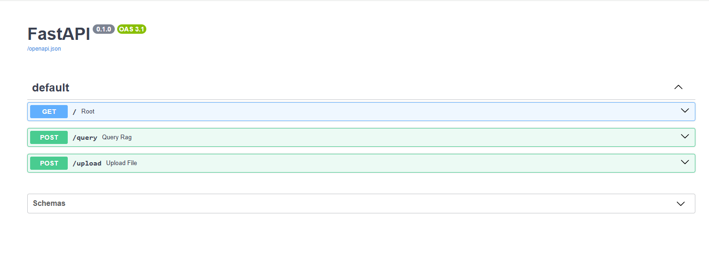
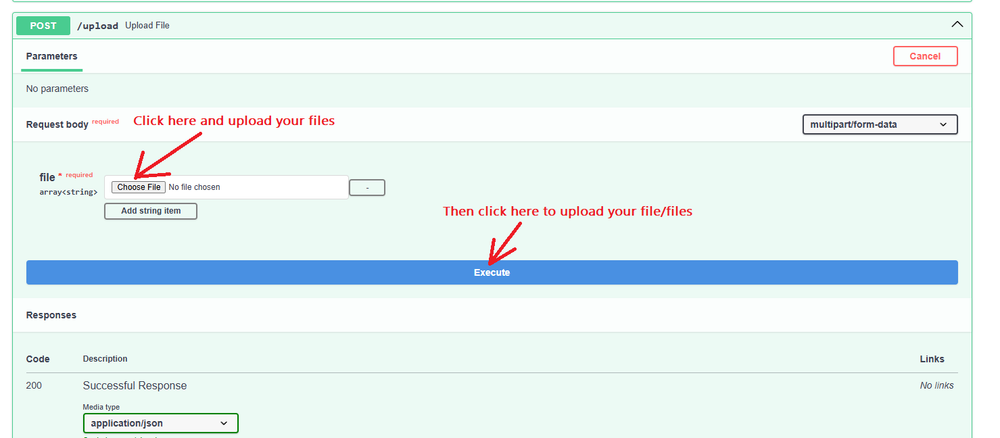
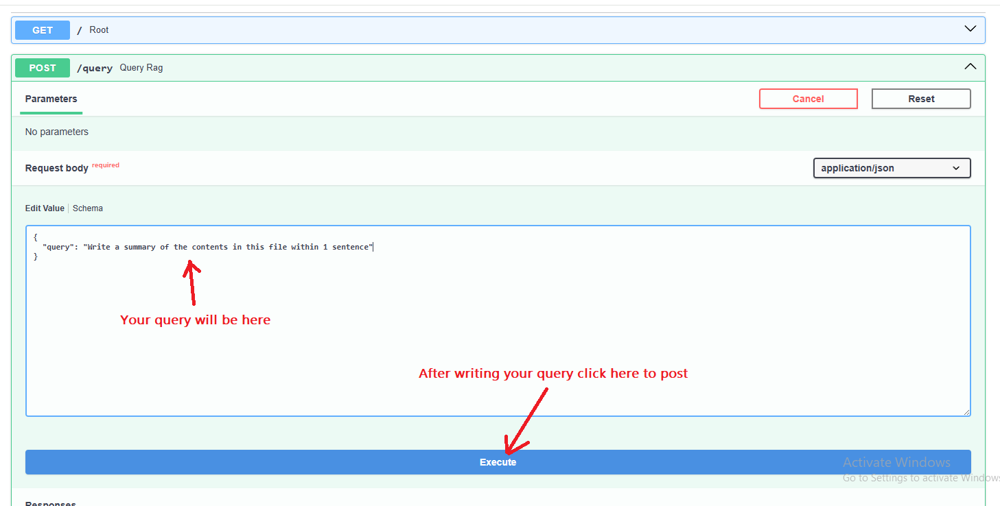
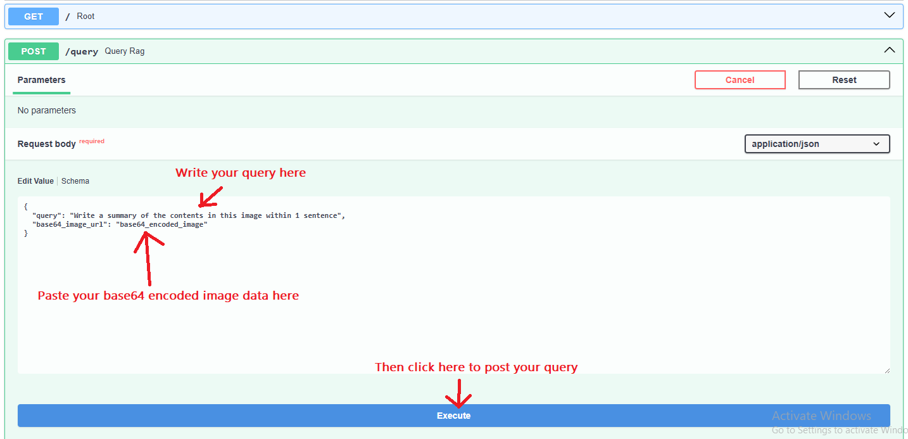
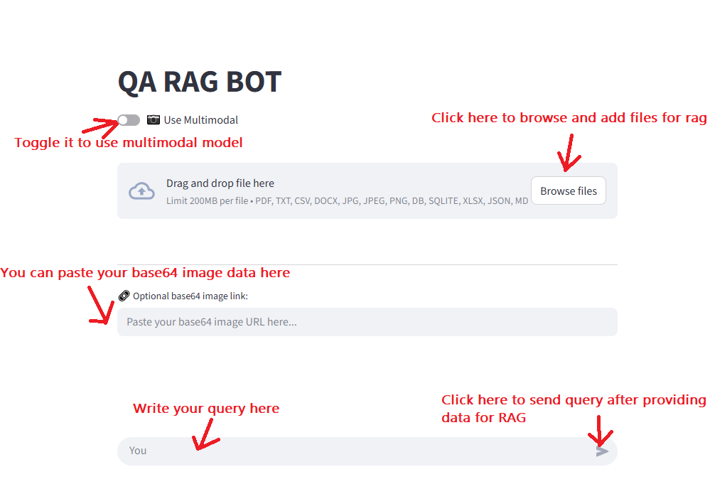
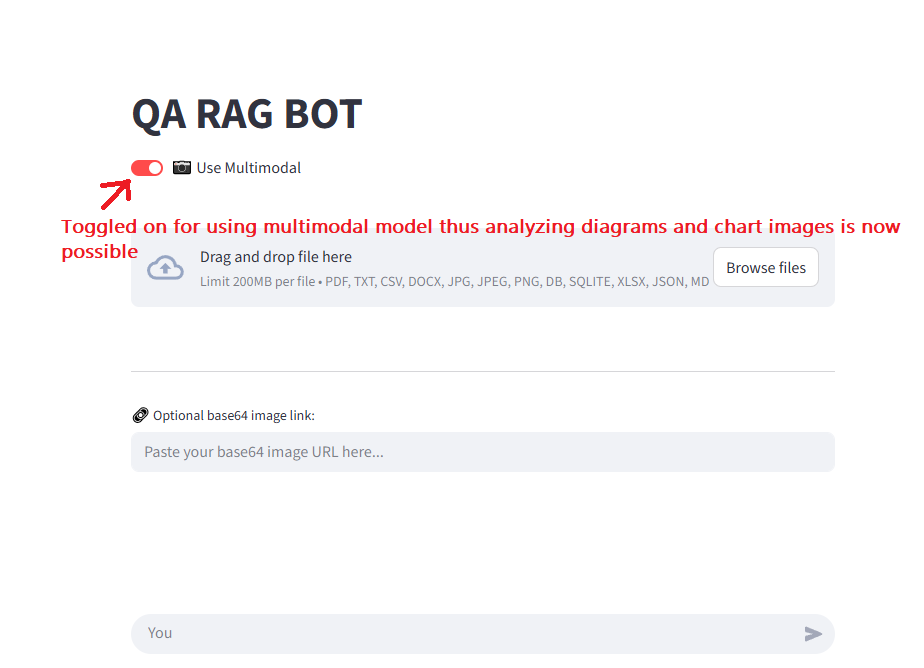
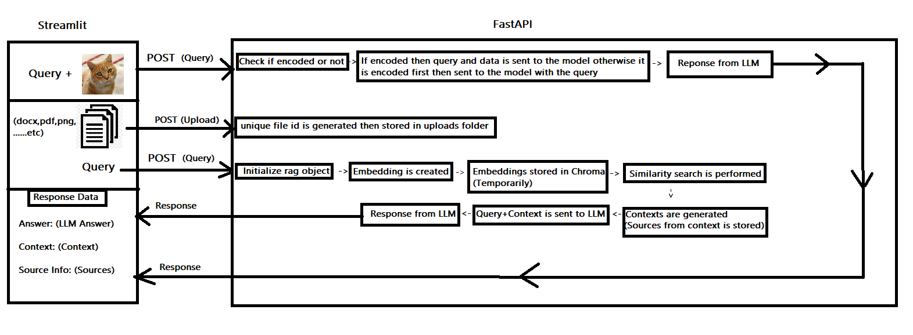

### Features
- RAG support for various file formats. [e.g doc, pdf, csv, xlsx, jpg, jpeg, png, sql, .db and etc]
- OCR-Tesseract support with pytesseract to extract texts from images for context.
- Upload route with multiple files and Query with image supported. [base64 image encoded]
- Image URL's are also supported for multimodal models
- Multimodal model can describe images or analyze diagrams and such from an image.
- Multimodal model supports Image urls in the base64 encoded image field.
- Streamlit app for an interactive user experience.
- Docker compose to build container from images.
- Utilizes Langchain.

**Table of Contents**

- [Project Setup](#project-setup)
- [Fastapi Manual](#fastapi-manual)
  - [Swagger UI](#swagger-ui)
  - [Using CURL](#using-curl)
- [Streamlit Manual](#streamlit-manual)
- [Workflow](#workflow)
- [Unit Tests](#unit-tests)

# Project Setup
First clone this git repository using the git command or you can also download the project file.
To clone this repository use the following git command:

```markdown 
git clone https://github.com/Platinum-Pluto/QA_RAG_FastAPI.git
```

After cloning the project edit the sample .env file given with your api credentials such as:

```markdown
API_KEY = Your_API_KEY
MODEL = gemini-2.5-flash
PROVIDER = google_genai
```


Since the images for this project exists in my dockerhub repository you can either pull both of the images required for this project or build the images and create their container in your own PC.
However you need docker desktop installed in your system.
Here is a link to the docker desktop page if you do not have docker installed:

```markdown
https://www.docker.com/products/docker-desktop/
```

If you want to pull the already built images from my repository then use the following docker command in terminal:

```markdown
docker pull mediocrejudge9087/qa_rag_fastapi-fastapi:latest
```
```markdown
docker pull mediocrejudge9087/qa_rag_fastapi-streamlit:latest
```

Or,

if you want to build it in your own PC then simply open a terminal in the project folder and run the following docker command:

```markdown
docker compose up --build 
```

This will take a while but it will build the images and start up your container will will start both the FASTapi server in port 8000 and the Streamlit app in port 8501 locally.

If you pull the images from my dockerhub repository then you can navigate to the project folder and open terminal and simple run the following command to start up FASTapi and Streamlit:

```markdown
docker compose up
```

This is the link to open the FASTapi swagger UI for an interactive experience and tests with the FASTapi server:

```markdown
http://localhost:8000/docs#/
```

And this is the link to open the Streamlit app:

```markdown
http://localhost:8501/
```

Copy paste them in the browser search bar.

The Streamlit app communicates with the FASTapi server to send and retrieve data.


After setting up the docker images and container remember to put in the API key, model name and provider name in the .env file and then run `docker compose up` otherwise without these the LLM model will not work.

> ⚠️ **Warning:** Currently this project only supports Gemini models for both multimodal support I used Gemini 2.5 flash model so use Gemini api.  
> ⚠️ **Warning:** If you want to change the model you want to use then open rag.py and change the `os.environ["GOOGLE_API_KEY"] = os.getenv("API_KEY")` to the following Langchain supported LLM's then simply copy paste to replace the existing one with any one of the below of which you want to use:  
`os.environ["OPENAI_API_KEY"] = os.getenv("API_KEY")` [Provider in .env will be openai]  
`os.environ["ANTHROPIC_API_KEY"] = os.getenv("API_KEY")` [Provider in .env will be anthropic]  
`os.environ["GROQ_API_KEY"] = os.getenv("API_KEY")` [Provider in .env will be groq]  
`os.environ["COHERE_API_KEY"] = os.getenv("API_KEY")` [Provider in .env will be cohere]  
`os.environ["NVIDIA_API_KEY"] = os.getenv("API_KEY")` [Provider in .env will be nvidia]  
`os.environ["FIREWORKS_API_KEY"] = os.getenv("API_KEY")` [Provider in .env will be fireworks]  
`os.environ["MISTRAL_API_KEY"] = os.getenv("API_KEY")` [Provider in .env will be mistralai]  
`os.environ["TOGETHER_API_KEY"] = os.getenv("API_KEY")` [Provider in .env will be together]  
`os.environ["XAI_API_KEY"] = os.getenv("API_KEY")` [Provider in .env will be xai]  
`os.environ["PPLX_API_KEY"] = os.getenv("API_KEY")` [Provider in .env will be perplexity]

Here is a list of models and their providers which you can copy paste and use:
```For this project I used MODEL=gemini-2.5-flash and PROVIDER=google_genai in the .env file```

| Model Name                                    | Provider      |
|----------------------------------------------|---------------|
| gemini-2.5-flash                              | google_genai  |
| gpt-4o-mini                                   | openai        |
| claude-3-5-sonnet-latest                      | anthropic     |
| llama3-8b-8192                                | groq          |
| command-r-plus                                | cohere        |
| meta/llama3-70b-instruct                      | nvidia        |
| accounts/fireworks/models/llama-v3p1-70b-instruct | fireworks |
| mistral-large-latest                          | mistralai     |
| mistralai/Mixtral-8x7B-Instruct-v0.1          | together      |
| grok-2                                        | xai           |
| llama-3.1-sonar-small-128k-online             | perplexity    |


And change the .env model name, api key and provider based on your needs. 


# Fastapi Manual
### Swagger UI
If you decide to use Swagger UI to utilize the FastAPI server then 
```markdown
http://localhost:8000/docs#/
```
Go to this link in any browser and a window will open up which will look like this


Now first you have to upload your files as shown in the image below


After uploading your file/files then go to the query section and now you can send your query as shown in the image below


If you just want to send a query with a base64 encoded image then write your query and paste your base64 image data as shown in the image below


### Using CURL

If you want to use curl command then use the following commands,
#### Upload
For uploading file/files
```bash
curl -X 'POST' \
  'http://localhost:8000/upload' \
  -H 'accept: application/json' \
  -H 'Content-Type: multipart/form-data' \
  -F 'file=@Python Assignment.pdf;type=application/pdf'
```

The response will be
```markdown
{
  "message": "File uploaded successfully.",
  "file_id": [
    "2a836ea0-8240-4b49-a8dc-9c46cc7a2cfc"
  ],
  "filename": [
    "Python Assignment.pdf"
  ]
}
```
#### Query
For sending the query after uploading file/files
```bash
curl -X 'POST' \
  'http://localhost:8000/query' \
  -H 'accept: application/json' \
  -H 'Content-Type: application/json' \
  -d '{
  "query": "Write summary of this file within 3 sentences."
}'
```
For sending query with base64 encoded image
```bash
curl -X 'POST' \
  'http://localhost:8000/query' \
  -H 'accept: application/json' \
  -H 'Content-Type: application/json' \
  -d '{
  "query": "Describe this image.",
  "base64_image_url": "base64_encoded_image"
}'
```
The response will be
```markdown
{
  "Context": [],
  "Response": "",
  "Source Info": []
}
```

# Streamlit Manual
The image below shows the description and details on the streamlit app usage.


You can toggle the "Use Multimodal" on/off to use multimodal model functionalities to analyze diagrams and charts images.


# Workflow




# Unit Tests
The code below is for generating a unit test report of the FastAPI functionalities and checking if its working for all cases.
Feel free to use it.
Use the terminal command below to run the unit test code
```markdown
pytest your_unit_test_filename.py -s
```

```python
import pytest
import requests
import time
from pathlib import Path
import base64 


BASE_URL = "http://localhost:8000"
UPLOAD_URL = f"{BASE_URL}/upload"
QUERY_URL = f"{BASE_URL}/query"
QUERY = "Can you summarize this file within a sentence?"


def base64_encoder(image_path = "test_files/file.jpg"):

    with open(image_path, "rb") as image_file:
        image_data = base64.b64encode(image_file.read()).decode("utf-8")

    print(image_data)
    return image_data


TEST_FILES = [
    "test_files/file.pdf",
    "test_files/file.docx",
    "test_files/file.txt",
    "test_files/file.png",  # Checking tesseract
    "test_files/file.csv",
    "test_files/file.sql",
    "test_files/file.xlsx",
    "test_files/file.json",
    "test_files/file.md"
]

BASE64_IMAGE = (
    base64_encoder() #Just a helper function so that copy pasting huge base64 encoded image data is not clogging up this whole code file
    #Or directly add the encoded base64 image data here
)

CAT_IMAGE_URL = "https://upload.wikimedia.org/wikipedia/commons/3/3a/Cat03.jpg"


REPORT_PATH = "test_report.txt"


@pytest.fixture(scope="session", autouse=True)
def clear_report_file():
    with open(REPORT_PATH, "w", encoding="utf-8") as f:
        f.write("FASTAPI RAG TEST REPORT\n\n")
    yield


def format_response(json_data):
    context = "\n".join(f"- {line.strip()}" for line in json_data.get("Context", []))
    source = "\n".join(f"- {line.strip()}" for line in json_data.get("Source Info", []))
    return (
        f"Response:\n{json_data.get('Response', '')}\n\n"
        f"Context:\n{context or 'None'}\n\n"
        f"Source Info:\n{source or 'None'}"
    )


def log_result(title: str, file_name: str, json_data=None, error=None):
    with open(REPORT_PATH, "a", encoding="utf-8") as f:
        f.write(f"{'='*80}\n")
        f.write(f"[{title}] - {file_name}\n")
        if json_data:
            f.write(format_response(json_data))
        elif error:
            f.write(f"Error:\n{error}")
        f.write(f"\n{'='*80}\n\n")


@pytest.mark.parametrize("file_path", TEST_FILES)
def test_upload_and_query_file(file_path):
    file_name = Path(file_path).name

    try:
        with open(file_path, "rb") as f:
            files = {"file": (file_name, f)}
            upload_res = requests.post(UPLOAD_URL, files=files)
        assert upload_res.status_code == 200
        log_result("UPLOAD SUCCESS", file_name)
        time.sleep(60)

        query_res = requests.post(QUERY_URL, json={"query": QUERY})
        assert query_res.status_code == 200
        json_data = query_res.json()
        assert "Response" in json_data
        log_result("QUERY SUCCESS", file_name, json_data=json_data)
        time.sleep(60)

    except Exception as e:
        log_result("FAIL", file_name, error=str(e))
        pytest.fail(f"Test failed for: {file_name} — {e}")


def test_base64_image_query():
    try:
        query_res = requests.post(QUERY_URL, json={"query": QUERY, "base64_image_url": BASE64_IMAGE})
        assert query_res.status_code == 200
        json_data = query_res.json()
        assert "Response" in json_data
        log_result("BASE64 QUERY SUCCESS", "BASE64_IMAGE", json_data=json_data)

    except Exception as e:
        log_result("BASE64 QUERY FAIL", "BASE64_IMAGE", error=str(e))
        pytest.fail(f"Base64 image test failed — {e}")


def test_url_image_query():
    try:
        query_res = requests.post(QUERY_URL, json={"query": QUERY, "base64_image_url": CAT_IMAGE_URL})
        assert query_res.status_code == 200
        json_data = query_res.json()
        assert "Response" in json_data
        log_result("URL QUERY SUCCESS", "CAT_IMAGE_URL", json_data=json_data)

    except Exception as e:
        log_result("URL QUERY FAIL", "CAT_IMAGE_URL", error=str(e))
        pytest.fail(f"URL image test failed — {e}")

```